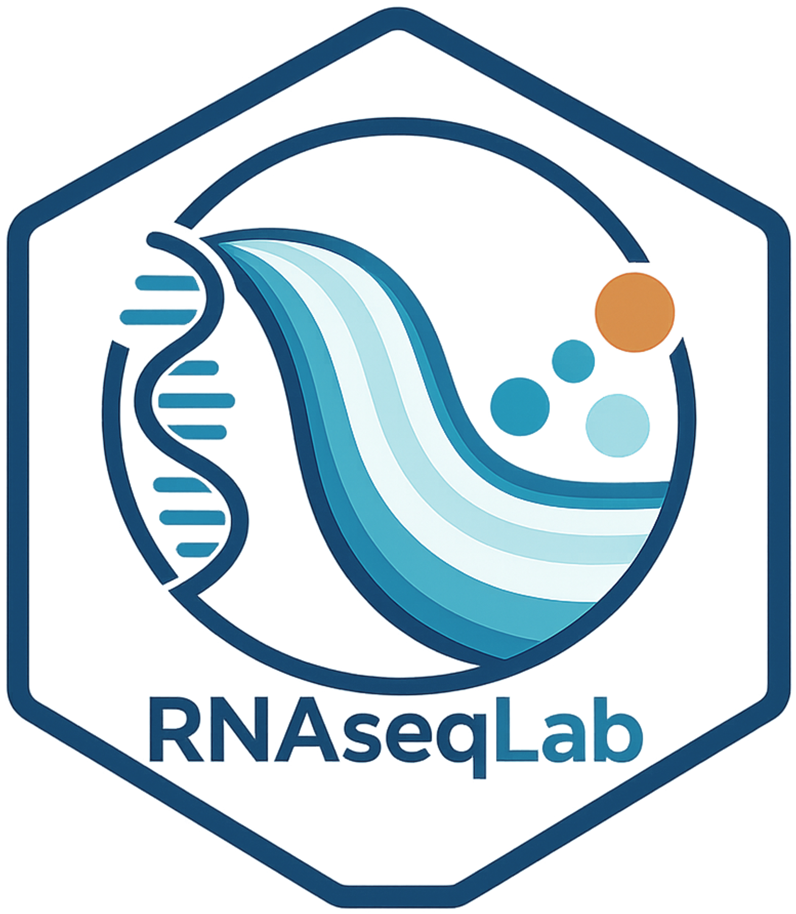

<h1>
  
  RNAseqLab: Expression & Downstream Analysis Dashboard
</h1>

RNAseqLab is an interactive R Shiny platform for comprehensive RNA-seq analysis, supporting count and transcript quantification data, differential gene expression, gene set enrichment analysis (GSEA), transcript and isoform-level analyses, functional annotation, and downstream exploration and visualization.


<h1></h1>

**Author:** Yonatan Yerushalmy  
Plant's metabolism and molecular genetic lab, Prof. Rachel Amir group

**Repository:**  
[https://github.com/Yo-yerush/RNAseqLab.git](https://github.com/Yo-yerush/RNAseqLab.git)


**Cite:**  
Yerushalmy, Y., & Amir, R. (2026). *RNAseqLab: An interactive platform for RNA-seq differential expression and functional interpretation*, (Version 0.9.1). Zenodo. [doi.org/10.5281/zenodo.21640051](https://doi.org/10.5281/zenodo.21640051)

## How To Run On Windows

1. Install R for Windows, preferably R 4.2 or newer.
2. Extract the project folder.
3. First time: double-click `install.bat`.
4. Later runs: double-click `RNAseqLab.bat`.

If `Rscript.exe was not found in PATH`, add your R `bin` folder to PATH, usually:

```text
C:\Program Files\R\R-4.x.x\bin
```

## Run on macOS or Linux

Open a terminal in the repository root and run the installer once, then launch the app:

```sh
Rscript app/install_packages.R
Rscript app/launch_app.R
```

`launch_app.R` is platform-independent and starts the local Shiny app in the default browser. The `.bat` files are Windows-only convenience launchers.

## Data Input

### Upload DE Results

Upload CSV, TSV, TXT, XLS, or XLSX differential expression results. The app auto-detects comma and tab delimiters for text files.

Must include columns:

| Column | Description |
|--------|-------------|
| `gene_id` | Gene identifier, for example TAIR, Ensembl, Entrez, or symbol |
| `log2FoldChange` | log2 fold change |
| `padj` | adjusted p-value |

If standard column names are not found, the app treats the first three columns as `gene_id`, `log2FoldChange`, and `padj`.

After loading the table, the app auto-detects common `gene_id` formats such as TAIR, Ensembl, RefSeq, Entrez, UniProt, and gene symbols, then updates the Gene ID type in the Organism annotations tab. You can still change it manually.

### Run DESeq2 From Quantification Or Count Files

The app can run DESeq2 directly from several count/quantification input types:

| Input type | Expected files | Notes |
|------------|----------------|-------|
| RSEM gene mode | `*.genes.results` | Default RSEM mode. Input rows are treated as gene IDs. |
| RSEM transcript mode | `*.isoforms.results` | Check **RSEM files contain transcript/isoform IDs (not gene IDs)** and provide a two-column tx2gene table. |
| Salmon | `*/quant.sf` | One sample folder per `quant.sf`; requires tx2gene. |
| Kallisto | `*/abundance.tsv` | One sample folder per `abundance.tsv`; requires tx2gene. |
| featureCounts | one uploaded TXT/TSV/CSV table | Uses columns after `gene_biotype` when present, otherwise after `Length`. |
| Count matrix | one uploaded CSV/TSV/TXT/XLS/XLSX table | First column is gene IDs; remaining columns are raw sample counts. |

The app scans sample IDs and creates editable colData. If an RSEM folder contains `*.isoforms.results` but gene mode is selected, the scan stops safely and asks you to check **RSEM files contain transcript/isoform IDs (not gene IDs)** instead of failing with a row-length error.

colData supports CSV, TSV, TXT, XLS, and XLSX files. Text files can use comma or tab delimiters.

Supported column patterns:

| Column | Column positions options | Is unique? |
|----------|--------------|--------------|
| `sample_id` | `1st` / `2nd` | Yes |
| `condition` | `1st` / `2nd` / `3rd` | No |
| `sample_label` optional | `2nd` / `3rd` / `4th` | Yes |
| `effect` optional | `≥ 3rd` | NO |

After colData is loaded, use the **Condition / group column** selector above the colData preview to choose which column defines treatment/control groups.

tx2gene options support:

- Upload a two-column tx2gene table.
- Build tx2gene from GTF/GFF by choosing transcript and gene ID attributes.
- Build Arabidopsis TAIR-style tx2gene by stripping the final `.number` suffix from transcript IDs.
- Preview and download the generated tx2gene table before using it.
- The **Use tx2gene** action displays progress while the selected mapping is read, generated, validated, and saved for the DESeq2 import.

### Transcript / Isoform Analysis

**Transcript / Isoform Analysis** is a permanent main tab immediately before **Run All**. Its title uses the normal theme color when the current input is RSEM transcript/isoform mode, Salmon, or Kallisto, and appears light gray for gene-level or uploaded-DE inputs. Analysis outputs become available only after a successful DESeq2 run from RSEM `*.isoforms.results`, Salmon, or Kallisto with a valid tx2gene mapping.

The same transcript quantification supports two complementary analyses:

- Transcript abundances summarized to genes for the existing DESeq2 differential gene-expression workflow.
- Transcript-level abundance retained for differential transcript usage with DRIMSeq and stageR.

The DTU workflow:

- Requires a valid tx2gene mapping and at least two biological replicates per condition; three or more replicates are strongly preferred.
- Uses transcript-level count-scale abundance imported with tximport and filters low-count or low-usage transcripts before testing.
- A transcript can pass the filter by being sufficiently expressed in the required number of samples from either condition, so condition-specific isoforms can be retained even when nearly absent from the other condition.
- Genes with fewer than two transcripts remaining after filtering are excluded because within-gene usage and stageR DTU correction require at least two testable isoforms.
- Uses DRIMSeq to test changes in transcript proportions within a gene.
- Uses stageR for gene-level screening followed by transcript-level confirmation and overall false-discovery-rate control.
- Reports control usage, treatment usage, delta usage, raw p-values, gene FDR, transcript stage-wise adjusted p-values, and DGE/DTU classification. Gene symbols and short descriptions are included in gene- and transcript-level tables when available from the current annotation.
- DRIMSeq and stageR run synchronously. Tables and plots appear only after the complete analysis finishes; large transcript datasets can take substantial time and memory.

The tab contains:

- **Overview:** numbers of tested genes/transcripts, significant DTU genes, candidate switches, and DGE/DTU classification counts.
- **DTU results:** downloadable gene- and transcript-level result tables.
- **Gene viewer:** searchable gene selector, replicate-level stacked usage plot, mean isoform-usage switch plot, total normalized gene-expression plot, and transcript-usage table.
- **DGE vs DTU:** comparison of gene-level DESeq2 evidence with gene-level DTU evidence.

A candidate **isoform switch** is defined conservatively as a gene that passes the selected DTU FDR, changes its dominant transcript between control and treatment, and has at least the selected minimum absolute change in transcript usage. DTU is broader than isoform switching, so significant DTU genes do not necessarily receive the switch label.

Extra colData columns are preserved. You can choose one extra effect column for DESeq2:

- No extra effect: `~ condition`
- Adjusted model: `~ condition + effect`
- Interaction model: `~ condition + effect + condition:effect`

The Data tab prints the exact design formula and contrast used.

When running DESeq2, the selected treatment/control comparison still drives the main DE table and all downstream analyses. The app also extracts every condition level versus the selected control from the same DESeq2 model. The Data tab shows a Venn diagram of shared significant gene IDs across comparisons, with display controls for the Venn colors, and provides a combined all-comparisons CSV download.

In DESeq2 mode, tables with gene rows include a small plot button column. Clicking it opens a normalized-count boxplot for that gene when normalized counts are available.

## Organism And Gene ID Settings

The **Organism annotations** tab controls organism-wide settings:

- Search/select organism name or NCBI taxonomy ID.
- Choose **Gene ID type**: common OrgDb key types such as `TAIR`, `ENTREZID`, `SYMBOL`, `ALIAS`, `ENSEMBL`, `REFSEQ`, `ACCNUM`, and `UNIPROT` where supported by the selected OrgDb.
- The Gene ID type is used by annotation builders, GO, KEGG, PMN, and MSigDB/Hallmark where relevant.

Default annotation buttons are available for Arabidopsis, human, and E. coli K-12 MG1655 when those organisms are selected.

The UniProt builder scans available UniProt ID columns for the selected organism, lets you choose an ID source, and builds a description table using that source as the new `gene_id`. For human Ensembl IDs, for example `ENSG00000141510`, the builder can use the selected OrgDb, such as `org.Hs.eg.db`, to bridge Ensembl IDs to UniProt annotations.

The RefSeq GTF builder accepts NCBI-downloaded GTF files, scans GTF attributes and `db_xref` values, then lets you choose which ID source becomes the new `gene_id`. This is useful for switching from locus tags such as `b0001` to RefSeq protein IDs such as `NP_414542`.

When a builder replaces `gene_id`, the original loaded ID is kept in `original_gene_id` for traceability.

Annotation table downloads include the organism name and tax ID in the filename.

## Tabs And Features

### Data Input

- Summary of loaded genes.
- Editable colData in DESeq2 count/quantification mode.
- All condition-vs-control DESeq2 results with a shared significant-gene Venn diagram.
- PCA plot after running DESeq2 from quantification/count files.
- PCA condition selector and sample-label toggle.
- DE table preview.
- Download DE table and normalized counts.

### Organism Annotations

- Load a manual annotation CSV/TSV/TXT.
- Build annotation table from UniProt.
- Build annotation table from RefSeq/NCBI GTF.
- Select organism and Gene ID type.
- Preview and download current annotation source.

### DE Results

- Volcano plot.
- MA plot, requires `baseMean`.
- Expression heatmap from DESeq2 VST values, with top-variable or significant-DE genes; optional row Z-scores; independent gene/sample hierarchical clustering; condition annotations; gene-symbol labels where available; shared up/down plot colors; and plot/matrix downloads.
- Full-text search across annotation columns.
- Supports AND-style space-separated terms and OR with `|`.

### GO Analysis

- topGO enrichment with `weight01`, `classic`, or `elim`.
- Fisher or KS statistic.
- **GO genes** sub-tab: choose one or more GO IDs and view matched loaded genes as a volcano plot and table.
- REVIGO-like local semantic reduction using `rrvgo`.
- GO offspring summaries for custom parent GO terms.
- Abiotic stress (plants) GO enrichment.

GO display cutoff, ontology, and top-N controls appear in the sidebar only while on the GO tab.

### KEGG Analysis

- KEGG enrichment using `KEGGREST`.
- The app downloads KEGG pathway gene sets by KEGG organism code, for example `ath` or `hsa`, and caches them locally.
- For human Ensembl data, KEGG uses Entrez/numeric IDs, so the app maps selected Gene ID type to Entrez IDs through the selected OrgDb before matching pathways.
- For E. coli `eco`, KEGG pathway genes are usually `b####` locus tags. RefSeq protein IDs such as `NP_414542` can work for GO with `REFSEQ`, but they do not directly match the current KEGG `eco` pathway gene IDs unless mapped back to KEGG-compatible locus IDs.
- Bubble plot and enrichment table.
- Pathview pathway maps colored by log2FoldChange. Pathview also uses the same ID mapping, so Ensembl human genes can be colored correctly after mapping.

### Gene Set Enrichment (GSEA)

- Preranked analysis with `fgsea::fgseaMultilevel` over **all tested genes**, without first applying a significant-gene cutoff. A DE-results upload should therefore contain the complete tested-gene table; the app warns when the loaded file appears to contain only significant rows.
- Database choices:
  - GO Biological Process
  - KEGG
  - MSigDB Hallmark
  - PMN
  - TEG superfamilies for Arabidopsis only
  - uploaded custom GMT gene sets
- GO, KEGG, Hallmark, and PMN use the organism/database and Gene ID settings selected in their corresponding tabs. Custom GMT genes must use identifiers compatible with the loaded DE table.
- **TEG superfamilies (Arabidopsis)** is shown only when Arabidopsis thaliana (tax ID 3702) is selected. It uses the existing TAIR annotation and TAIR10 TE metadata to treat each transposable-element-gene superfamily as a separate gene set.
- Ranking choices:
  - DESeq2 statistic, when available (recommended)
  - signed `-log10(pValue)`, using the `log2FoldChange` sign
  - `log2FoldChange`
- Minimum and maximum set-size controls exclude gene sets whose overlap with the ranked list falls outside the selected range. This can matter for small TE superfamilies.
- Reports enrichment score (ES), normalized enrichment score (NES), p-value, adjusted p-value/FDR, pathway size, and leading-edge genes. Positive NES indicates enrichment near the top of the ranked list; negative NES indicates enrichment near the bottom.
- Result views and downloads include:
  - NES dotplot and complete pathway-results table
  - enrichment curve for the selected pathway
  - leading-edge gene table
  - complete selected-pathway gene table
  - selected-pathway volcano plot
- The selected-pathway volcano contains **only genes belonging to that pathway**; genes outside the pathway are not drawn as background points. Pathway genes are classified as upregulated, downregulated, or not significant using the current adjusted-p-value and log2FC thresholds and global plot colors.

### MSigDB/Hallmark

- Hallmark over-representation analysis using `msigdbr`.
- Supports up, down, or all significant genes.
- Uses the selected organism/species and Gene ID type where available.
- **Hallmark genes** sub-tab: choose one or more Hallmark set codes and view matched loaded genes as a volcano plot and table.
- Bubble plot and downloadable results table.

`msigdbr` may download/cache MSigDB data on first use.

### PMN (plants)

- Plant Metabolic Network pathway enrichment for plant Cyc databases, for example `AraCyc`, `OryzaCyc`, `CornCyc`, and `TomatoCyc`.
- The PMN Cyc DB is auto-selected from the organism in the Organism annotations tab when a known plant mapping exists.
- Downloads PMN tab-delimited pathway tables from the public PMN file bucket when PMN analysis or pathway lookup is run.
- PMN matching usually expects the organism locus IDs used by that Cyc database, such as TAIR locus IDs for AraCyc.
- Bubble plot, downloadable enrichment table, pathway-gene lookup table, and selected-pathway volcano plot.

### Genes Groups

- **Gene families - enrichment** sub-tab: tests significant genes against families and shows a top-10 dotplot plus a downloadable table.
- **Gene families** sub-tab: selected-family volcano plots and tables. Arabidopsis uses the RA lab database file:
  - `https://raw.githubusercontent.com/Yo-yerush/RA_lab_db/refs/heads/main/description_files/gene_families_sep_29_09_update.txt`
- Human uses HGNC `gene_has_family.csv` plus `family.csv`; `family.csv$name` is used as the family name. Input gene IDs are mapped to `hgnc_id`, while the original `gene_id` is kept in the preview table.
- Arabidopsis matching uses `Genomic_Locus_Tag` as uppercase `gene_id`, `Gene_Family` for selectable families, and shows `Sub_Family` in the preview table.
- **Custom groups - RA lab (At)** sub-tab: curated built-in gene sets with group-specific volcano plots and tables.
- Reference data is downloaded from GitHub on first use and cached in-session.

### TE Analysis

- Arabidopsis-specific TE workflows for transposable-element genes and DE genes overlapping nearby/gene-body TEs.
- **TEGs Enrichment Analysis**: TE superfamily enrichment for transposable-element genes.
- **TEGs Volcano Plot**: volcano plot for selected TE superfamilies.
- **Gene Set Enrichment (GSEA)** adds an Arabidopsis-only TEG superfamilies database. Each TAIR10 TE superfamily is treated as a gene set and tested across all ranked genes; the option is shown only when Arabidopsis (tax ID 3702) is selected.
- **Overlapped TEs**: finds DE genes whose upstream, downstream, both-side, or gene-body ranges overlap TAIR10 TEs.
- The Overlapped TEs tab shows:
  - overlapped-gene volcano, filterable by TE family
  - TE family count plot and downloadable family-count table
  - TE family enrichment plot and downloadable enrichment table
  - gene table with overlapped TE IDs, families, superfamilies, DE columns, and available annotation columns
- TE family enrichment uses Fisher exact tests and can compare against either all TAIR10 TEs or region-aware TEs that overlap the same selected gene-region windows across all TAIR genes.
- Uses default Arabidopsis annotation, TAIR10 TE metadata, and TAIR gene ranges from GitHub:
  - `https://github.com/Yo-yerush/RA_lab_db/raw/refs/heads/main/description_files/At_custom_description_file.csv.gz`
  - `https://raw.githubusercontent.com/Yo-yerush/RA_lab_db/refs/heads/main/description_files/TAIR10_Transposable_Elements.txt`
  - `https://raw.githubusercontent.com/Yo-yerush/RA_lab_db/refs/heads/main/description_files/TAIR_genes_short.csv`

Human or other organism TE analysis requires a compatible TE-level annotation table or TE quantification output, such as RepeatMasker/TEtranscripts-derived families. Standard human Ensembl gene-level DE tables do not directly contain TE family assignments.

### Run All

- Batch runner for exporting selected analyses into a timestamped `run_all_YYYYMMDD_HHMMSS` folder.
- Select all available outputs, clear selections, or choose specific outputs by section:
  - Core outputs: DE table, DE summary, normalized counts, Volcano, MA, PCA, and transcript/isoform DTU when transcript-level input is available.
  - Enrichment: GSEA, GO enrichment, REVIGO-like GO reduction, GO offspring summary, abiotic-stress GO enrichment, KEGG enrichment, Pathview, MSigDB/Hallmark, PMN enrichment, and PMN pathway-gene lookup.
  - TE analysis: TEG enrichment, TEG volcano, and Overlapped TEs when Arabidopsis is selected.
- Direction selector for enrichment-style analyses: upregulated only, downregulated only, up and down, all DE genes, or up/down/all.
- Unavailable analyses are hidden based on the selected organism and current app state.
- Outputs are organized into subfolders such as `Core_outputs`, `Transcript_Isoform`, `GO`, `KEGG`, `MSigDB_Hallmark`, `PMN`, and `TE_analysis`.
- Each run writes `run_all_log.txt`. If one selected analysis fails, the batch continues and the error is recorded in the log.
- Optional HTML report: when `rmarkdown`, `knitr`, and Pandoc are available, Run All creates `RNAseq_Run_All_Report.html` with plot images, CSV previews, file links, and short explanations for each analysis section.
- Gene family enrichment is included for Arabidopsis and human when available, with outputs saved under `Gene_Families`.
- The HTML report focuses on plots, analysis explanations, interpretation notes, and a parameter summary. Result tables are saved as CSV files in the output folders but are not embedded in the report.

### Log / Help

- Session log.
- Notes and app usage help.
- Parameters sub-tab showing the current analysis settings. It starts from defaults and updates when controls are changed.
- Dependencies sub-tab showing required R packages, installed status, versions, and which analyses are affected if a package is missing.

## Sidebar Controls

- Data input mode and DESeq2 count/quantification controls.
- Significance thresholds: `padj` and `|log2FC|`.
- Tab-specific plot size controls.
- GO and Hallmark filters only appear on their relevant tabs.
- Global point size, alpha, and colors.

The upregulated/downregulated/not-significant colors are used across DE result plots and enrichment visualizations where relevant, including GO, KEGG, MSigDB/Hallmark, Pathview, and gene group plots.

## Notes

- The bundled TE workflow is Arabidopsis-specific.
- GO requires the selected OrgDb package to be installed, for example `org.At.tair.db` or `org.Hs.eg.db`.
  - Some analysis tabs require extra Bioconductor packages when used, especially `GO.db`, `KEGGREST`, `pathview`, and the selected `org.*.db` organism package. The app can install supported OrgDb packages when GO is run.
- E. coli K-12 GO analysis supports `b####` locus tags through the app's alias normalization and supports RefSeq accessions through OrgDb `REFSEQ`/`ACCNUM` where available.
- KEGG and Pathview require internet access when KEGG data or pathway images are not cached.
- UniProt annotation building requires internet access.
- RefSeq GTF annotation building works from a local GTF file and does not require internet access after the GTF is downloaded.
- PCA requires count data and is available only after running DESeq2 from quantification/count files.
- Run All HTML reports require `rmarkdown`, `knitr`, and Pandoc. The installer installs the R packages, but Pandoc usually comes from RStudio, Quarto, or a standalone Pandoc installation. If Pandoc is missing, Run All still completes and skips the HTML report.
- No results are saved automatically. Use the download buttons.

## Troubleshooting R Not Found

The launcher searches for `Rscript.exe` in PATH and common Windows install locations:

- `C:\Program Files\R\...`
- `C:\Program Files (x86)\R\...`
- `%LOCALAPPDATA%\Programs\R\...`

If it still cannot find R, run `app/diagnose_R_installation.bat`, then edit the launcher path manually if needed:

```bat
set "RSCRIPT=C:\Program Files\R\R-4.5.0\bin\Rscript.exe"
```

## File Structure

- `app/` - main app folder:
  - `app.R` - Shiny dashboard UI/server.
  - `R/helpers.R` - DESeq2 pipeline, DE result plots, GO/MSigDB helpers, annotation utilities.
  - `R/run_all.R` - Batch Run output helpers, task execution, organized output folders, logging, and optional HTML report rendering.
  - `R/run_all_report.Rmd` - R Markdown template used to render the optional Run All HTML report.
  - `R/build_uniprot_description_file.R` - UniProt annotation builder, including Ensembl/SYMBOL/ENTREZID/TAIR ID support through OrgDb where available.
  - `R/build_refseq_gftf_description_file.R` - RefSeq GTF annotation builder for NCBI-downloaded GTF files, including selectable `db_xref`/attribute ID sources.
  - `legacy_scripts/kegg_analysis.R` - KEGG enrichment and KEGG ID mapping helpers.
  - `legacy_scripts/volcano_TEG_overlap_with_TE_families_RNAseq.R` - Arabidopsis TE superfamily enrichment and volcano helpers.
  - `install_packages.R` - installs the core CRAN and Bioconductor packages used by the app.
  - `launch_app.R` - launches the Shiny app from R.
  - `diagnose_R_installation.bat` - checks common Windows R installation paths if the launchers cannot find `Rscript.exe`.
  - `description_files/` - optional local data files. Default Arabidopsis, human, E. coli K-12 MG1655 annotation tables and TAIR10 TE metadata are loaded from GitHub when internet is available.
- `install.bat` - Windows first-run launcher that installs missing packages.
- `RNAseqLab.bat` - faster launcher for later runs.
